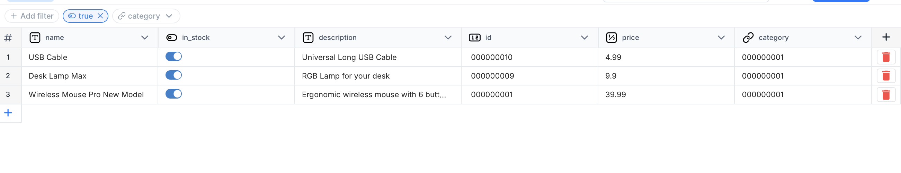
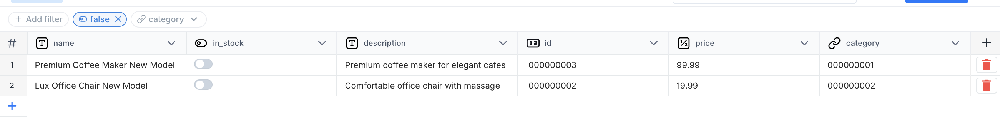

## Activity 4.1: View All Records

- All products are displayed in a list view.
- Each row represents one product record.
- The columns displayed are:
  - id
  - name
  - category
  - price
  - description
  - in_stock
- The layout is clean and tabular, making it easy to scan product information.

---

## Activity 4.2: Search and Filter

### Search Results

- Search for "Mouse"
  - Result: 1 item found
  - The item was "Wireless Mouse Pro"

- Search for "Pro"
  - Result: 1 item found
  - The item was "Wireless Mouse Pro"

- Search by category
  - When searching by category, all items that reference that specific category were displayed.
  - The system correctly filtered products based on their category_id relationship.

